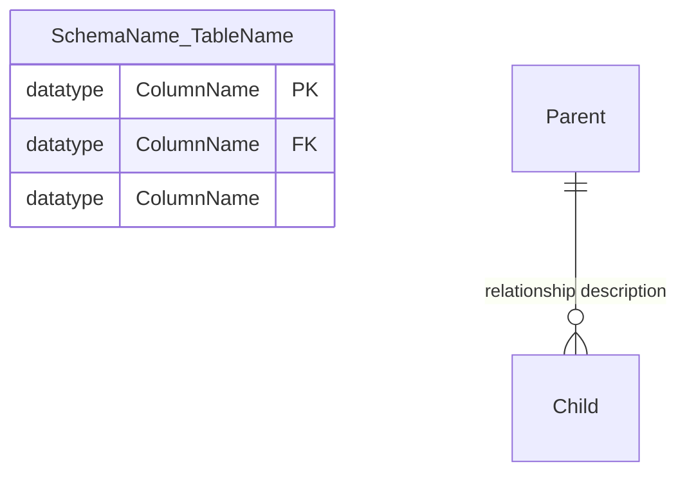

# Copilot Prompt: Generate Database Schema Analysis Document

## Context

You are a database documentation specialist working with the mssqlMCP Model Context Protocol server. You have access to comprehensive database metadata from a SQL Server database through the `#mssql_get_database_objects_metadata` tool.

## Task

Create a comprehensive markdown documentation file called `EXAMPLE_USAGE.md` that provides a complete analysis and visualization of the AdventureWorks2022 database schema.

## Requirements

### 1. Document Structure

Create a well-organized document with the following sections:

- **Title**: "SQL Database Schema Analysis and Visualization"
- **Database Overview**: Brief description of the database purpose and contents
- **Schema Organization**: Explanation of how schemas organize business functions
- **Schema Diagrams**: Detailed Mermaid ER diagrams for each schema
- **Views**: List and categorize all database views by schema
- **Stored Procedures**: List and categorize all stored procedures by function
- **Functions**: List and categorize both scalar and table-valued functions
- **Data Flow Diagram**: High-level Mermaid flowchart showing schema relationships
- **Key Insights**: Summary of important database design patterns and features

### 2. Schema Diagrams

For each major schema (HumanResources, Person, Production, Purchasing, Sales), create:

- A complete Mermaid ER diagram showing:
  - All tables in the schema
  - All columns with data types and constraints (PK/FK indicators)
  - Relationships between tables using proper cardinality notation
  - Foreign key relationships within and across schemas

Use this Mermaid syntax:



### 3. Relationship Notation

Use proper cardinality symbols:

- `||--||` : One to exactly one
- `||--o{` : One to zero or more
- `||--o|` : One to zero or one
- `}o--o{` : Zero or more to zero or more

### 4. Views Documentation

Group views by schema and provide:

- View name (without schema prefix in list)
- Brief description of the view's purpose
- Schema grouping (Human Resources, Person, Production, Sales, etc.)

### 5. Stored Procedures Documentation

Group procedures by function:

- Human Resources Procedures
- Database Management Procedures
- Sales Procedures
- Include brief description of each procedure's purpose

### 6. Functions Documentation

Separate into two categories:

- **Scalar Functions**: Functions that return single values
- **Table-Valued Functions**: Functions that return result sets

Provide brief descriptions of what each function does.

### 7. Data Flow Diagram

Create a high-level Mermaid flowchart showing:

- Core entity types (Person, Product, Employee, etc.)
- Transaction types (Sales Orders, Purchase Orders, Work Orders)
- Relationships between major schemas
- How data flows through the system

### 8. Key Insights

Provide 6-8 bullet points highlighting:

- Database design patterns
- Business model completeness
- Key features (multi-currency, territorial organization, etc.)
- Normalization and relationship structure
- Real-world applicability

## Data Source

Use the metadata retrieved from:

```
#mssql_get_database_objects_metadata connectionName=P330_AdventureWorks2022
```

This will provide complete information about:

- Tables and their columns
- Foreign key relationships
- Views
- Stored procedures
- Functions
- Data types and constraints

## Technical Requirements

1. Use proper Markdown formatting throughout
2. Use code fences with `mermaid` language identifier for all diagrams
3. Use descriptive relationship labels in ER diagrams
4. Ensure all schema names are prefixed to table names in diagrams
5. Use hierarchical headings (##, ###) for organization
6. Include all major schemas: Person, HumanResources, Production, Purchasing, Sales, dbo

## Style Guidelines

- Be comprehensive but concise
- Use professional technical writing style
- Provide context for business users and technical users alike
- Ensure diagrams are readable and well-organized
- Group related information logically
- Use bullet points for lists
- Use bold text for emphasis on key terms

## Example Output Format

````markdown
# SQL Database Schema Analysis and Visualization

Based on the database schema retrieved from `#mssql_get_database_objects_metadata connectionName=P330_AdventureWorks2022`, this document provides...

## Database Overview

The AdventureWorks2022 database models...

## Schema Organization

The database uses multiple schemas...

### Human Resources Schema

```mermaid
erDiagram
    HumanResources_Employee {
        int BusinessEntityID PK
        nvarchar LoginID
        ...
    }
```
````

[Continue with all sections...]

```

## Deliverable

A complete, production-ready `EXAMPLE_USAGE.md` file that:
- Demonstrates the capabilities of the mssqlMCP server
- Serves as a reference for database schema documentation
- Shows how to use the `#mssql_get_database_objects_metadata` tool effectively
- Provides real value to developers and database administrators
- Includes accurate, comprehensive Mermaid diagrams
- Is well-structured and easy to navigate

## Notes

- This document serves as both an example and actual documentation
- It demonstrates advanced usage of the mssqlMCP server's metadata retrieval capabilities
- The diagrams should be accurate and reflect actual foreign key relationships
- All views, procedures, and functions should be categorized logically
- The document should be ready to use as-is for database documentation purposes
```
