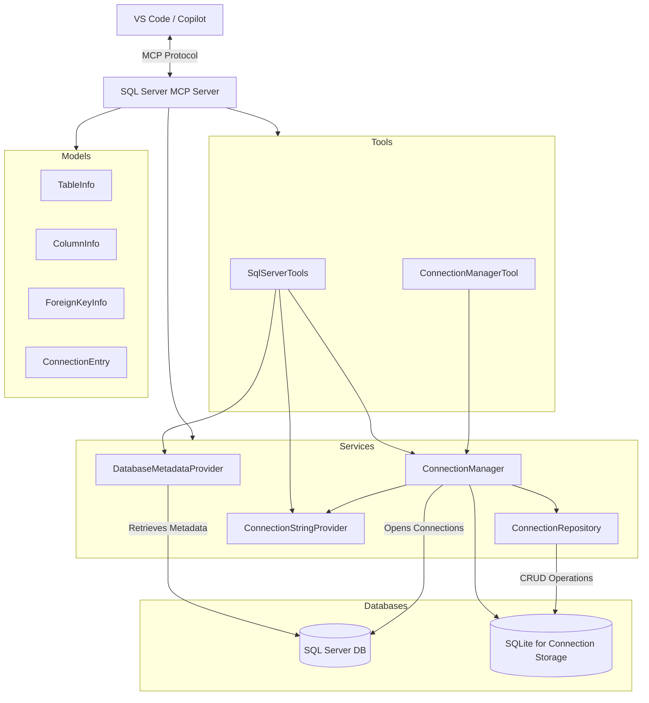
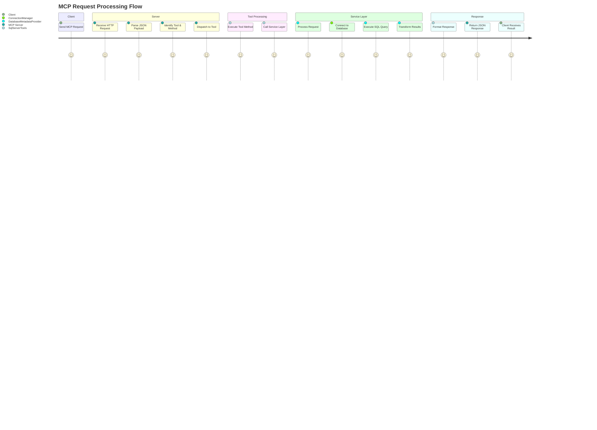
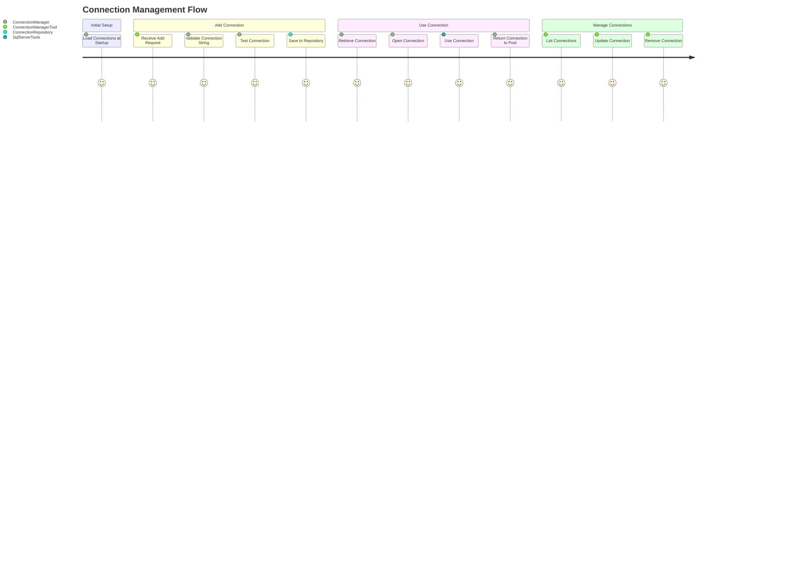
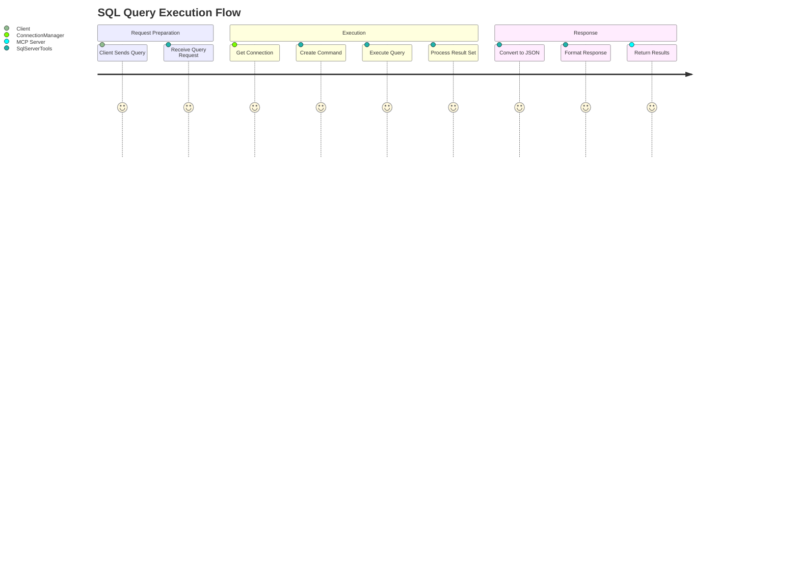

# SQL Server MCP Architecture

This document provides a comprehensive architectural overview of the SQL Server MCP (Model Context Protocol) Server, including component interactions, data flows, and implementation details.

## System Overview

The SQL Server MCP Server is a .NET-based application that implements the Model Context Protocol to provide SQL Server database connectivity for AI assistants like GitHub Copilot. The system enables retrieving metadata about database objects and executing SQL queries through a standardized protocol interface.

## Architecture Diagram

## Component Descriptions

### Client Layer

- **VS Code & Copilot**: Connects to the MCP server using HTTP transport and issues commands to interact with SQL databases.

### Server Core

- **MCP Server**: Provides the Model Context Protocol implementation including HTTP transport and tool registration.
- **Dependency Injection Container**: Manages component lifecycles and dependencies.
- **Logging**: Comprehensive logging using Serilog for diagnostics and troubleshooting.

### Tools Layer

- **SqlServerTools**: Exposes MCP tool methods for SQL Server operations to clients.
- **ConnectionManagerTool**: Manages database connection strings and connection information.

### Services Layer

- **DatabaseMetadataProvider**: Core service that queries SQL Server system tables to retrieve metadata.
- **ConnectionManager**: Manages database connections and connection pooling.
- **ConnectionRepository**: Persists connection information to SQLite database.
- **ConnectionStringProvider**: Retrieves connection strings from configuration and repository.

### Models Layer

- **TableInfo**: Represents database objects (tables, views, procedures, functions).
- **ColumnInfo**: Represents columns and parameters.
- **ForeignKeyInfo**: Represents foreign key relationships.
- **ConnectionEntry**: Represents saved database connections.

### Persistence Layer

- **SQL Server**: Target databases that the server connects to.
- **SQLite**: Local storage for connection information.

## Client Request Flow

The following diagram illustrates the typical flow of a client request through the system:

## Database Metadata Retrieval Flow

The following diagram shows the process of retrieving database metadata:

## Connection Management Flow

The following diagram illustrates how database connections are managed:

## SQL Query Execution Flow

This diagram shows the process of executing SQL queries:

## Key Technical Features

### Comprehensive Metadata

The system collects detailed metadata about:

- Tables with columns, primary keys, and foreign keys
- Views with column information and SQL definitions
- Stored procedures with parameters and SQL code
- SQL functions with parameters, return types and SQL code

### Connection Management

- Persisted connections in SQLite database
- Connection string security
- Connection testing and validation
- Connection pooling for performance

### Robust Error Handling

- Detailed error logging
- Client-friendly error messages
- Timeout handling
- SQL error analysis

### Performance Considerations

- Asynchronous operations throughout
- Connection pooling
- Timeout controls
- Cancellation support

## Extension Points

The architecture supports the following extension points:

1. **Additional Database Providers**

   - The system can be extended to support other databases by implementing new tool and provider classes

2. **Enhanced Metadata**

   - Additional metadata can be collected by extending the models and provider methods

3. **Additional MCP Tools**

   - New tool classes can be registered to extend functionality

4. **Authentication Mechanisms**
   - Security can be enhanced with additional authentication providers

## Security Considerations

1. **Connection String Security**

   - Connection strings are stored in a local SQLite database
   - Sensitive information should be protected

2. **SQL Injection Prevention**

   - Parameterized queries are used throughout the codebase
   - User input validation

3. **Error Information**
   - Error details are logged but sanitized before returning to clients

## Conclusion

The SQL Server MCP Server provides a robust implementation of the Model Context Protocol for SQL Server databases. With its clean architecture, comprehensive metadata support, and connection management capabilities, it enables AI assistants like Copilot to effectively explore and interact with SQL Server databases.
