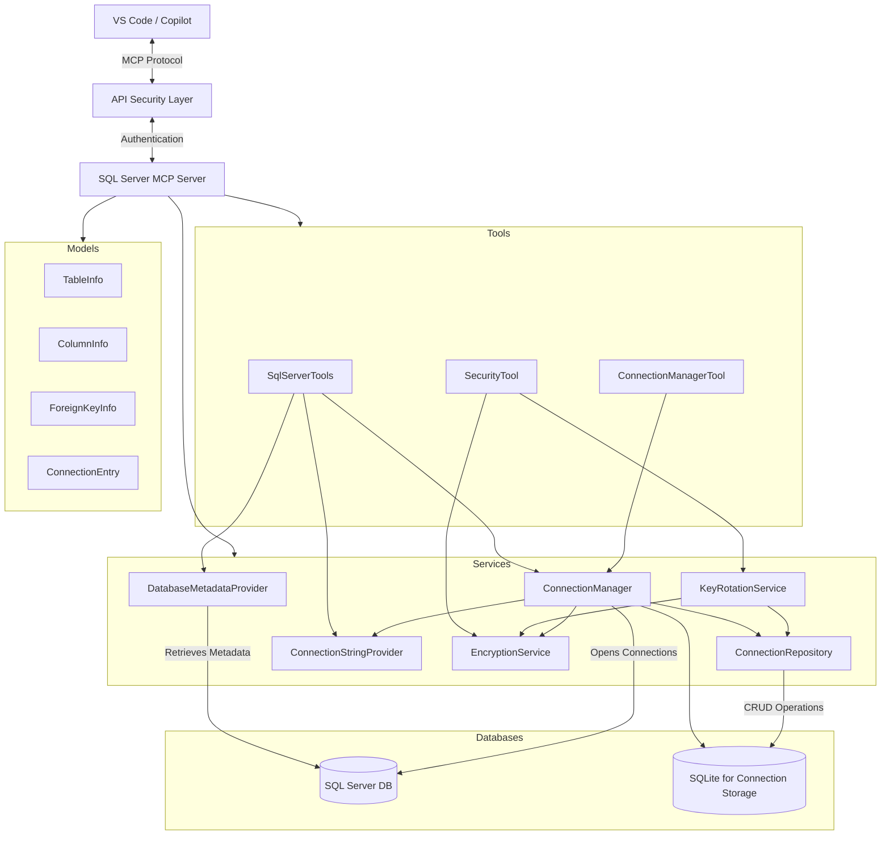
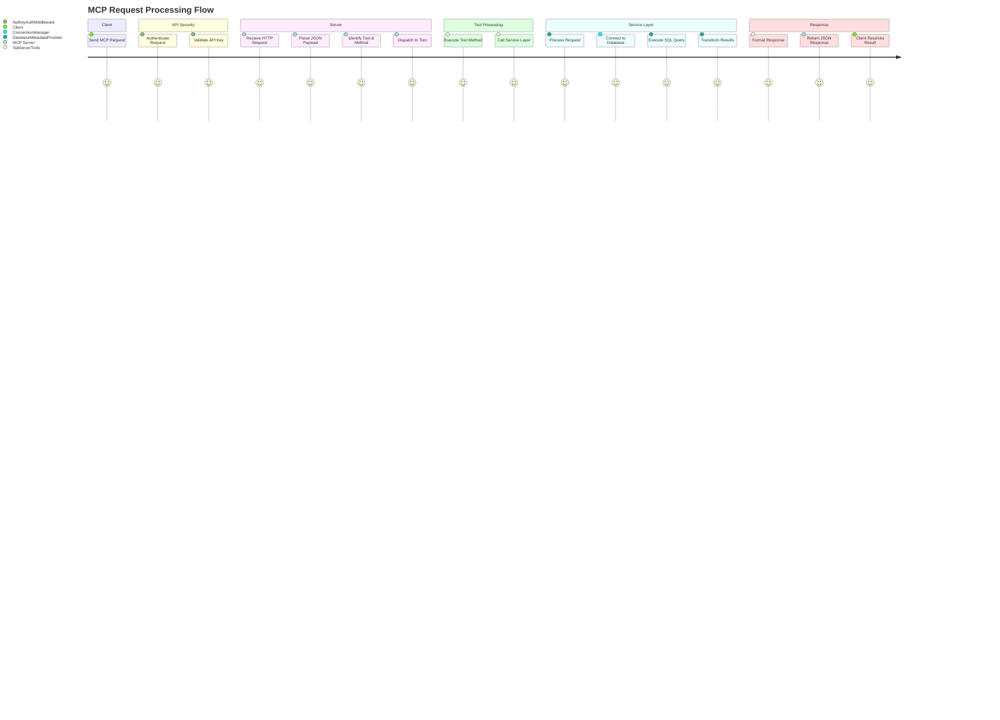
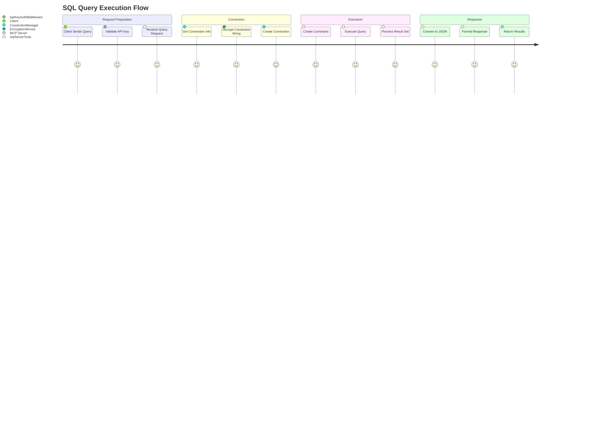
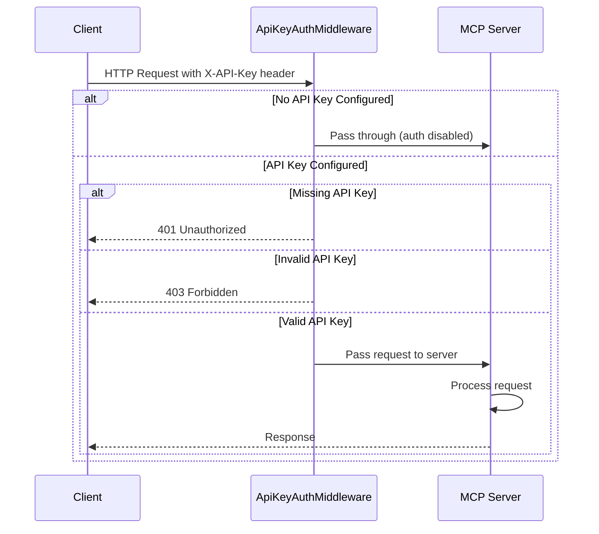
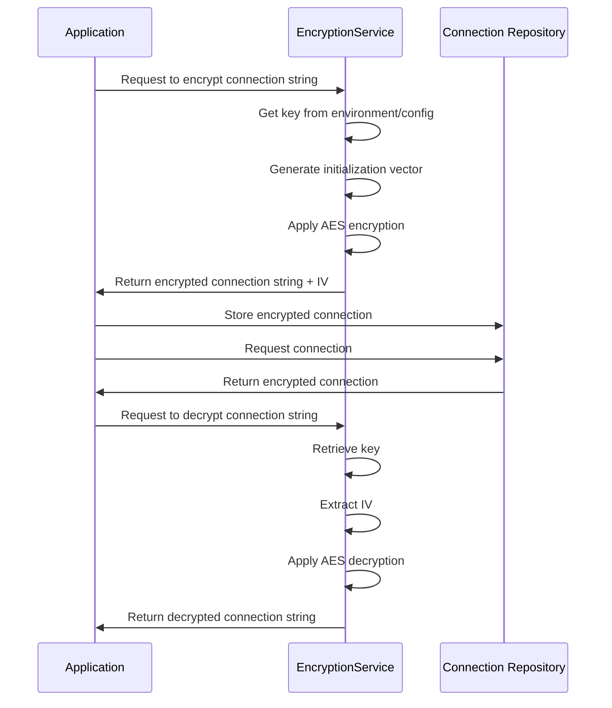
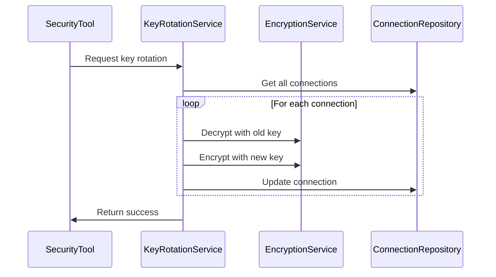

# SQL Server MCP Architecture

This document provides a comprehensive architectural overview of the SQL Server MCP (Model Context Protocol) Server, including component interactions, data flows, and implementation details.

## System Overview

The SQL Server MCP Server is a .NET-based application that implements the Model Context Protocol to provide SQL Server database connectivity for AI assistants like GitHub Copilot. The system enables retrieving metadata about database objects and executing SQL queries through a standardized protocol interface.

## Architecture Diagram

## Component Descriptions

### Client Layer

- **VS Code & Copilot**: Connects to the MCP server using HTTP transport and issues commands to interact with SQL databases.

### API Security Layer

- **API Key Authentication**: Validates API keys in request headers to secure access to the MCP server.
- **ApiKeyAuthMiddleware**: Middleware component that enforces API key validation for each request.

### Server Core

- **MCP Server**: Provides the Model Context Protocol implementation including HTTP transport and tool registration.
- **Dependency Injection Container**: Manages component lifecycles and dependencies.
- **Logging**: Comprehensive logging using Serilog for diagnostics and troubleshooting.

### Tools Layer

- **SqlServerTools**: Exposes MCP tool methods for SQL Server operations to clients.
- **ConnectionManagerTool**: Manages database connection strings and connection information.
- **SecurityTool**: Provides security operations such as key rotation, connection encryption, and secure key generation.

### Services Layer

- **DatabaseMetadataProvider**: Core service that queries SQL Server system tables to retrieve metadata.
- **ConnectionManager**: Manages database connections and connection pooling.
- **ConnectionRepository**: Persists connection information to SQLite database.
- **ConnectionStringProvider**: Retrieves connection strings from configuration and repository.
- **EncryptionService**: Handles the encryption and decryption of sensitive connection data.
- **KeyRotationService**: Manages the rotation of encryption keys for improved security.

### Models Layer

- **TableInfo**: Represents database objects (tables, views, procedures, functions).
- **ColumnInfo**: Represents columns and parameters.
- **ForeignKeyInfo**: Represents foreign key relationships.
- **ConnectionEntry**: Represents saved database connections.

### Persistence Layer

- **SQL Server**: Target databases that the server connects to.
- **SQLite**: Local storage for connection information.

## Client Request Flow

The following diagram illustrates the typical flow of a client request through the system:

## Database Metadata Retrieval Flow

The following diagram shows the process of retrieving database metadata:

## Connection Management Flow

The following diagram illustrates how database connections are managed:

## SQL Query Execution Flow

This diagram shows the process of executing SQL queries:

## Key Technical Features

### Comprehensive Metadata

The system collects detailed metadata about:

- Tables with columns, primary keys, and foreign keys
- Views with column information and SQL definitions
- Stored procedures with parameters and SQL code
- SQL functions with parameters, return types and SQL code

### Connection Management

- Persisted connections in SQLite database
- Connection string encryption with AES
- Connection testing and validation
- Connection pooling for performance
- Support for key rotation to enhance security

### API Security

- API key authentication via HTTP headers
- Configurable header name (default: X-API-Key)
- Flexible key storage (environment variable or configuration)
- Proper HTTP status codes for authentication failures (401, 403)
- Supports disabling authentication when no key is configured

### Robust Error Handling

- Detailed error logging
- Client-friendly error messages
- Timeout handling
- SQL error analysis
- Proper HTTP status codes for different error types

### Performance Considerations

- Asynchronous operations throughout
- Connection pooling
- Timeout controls
- Cancellation support
- Content type negotiation

## Security Features

### API Key Authentication

### Connection String Encryption

### Key Rotation

## Extension Points

The architecture supports the following extension points:

1. **Additional Database Providers**

   - The system can be extended to support other databases by implementing new tool and provider classes

2. **Enhanced Metadata**

   - Additional metadata can be collected by extending the models and provider methods

3. **Additional MCP Tools**

   - New tool classes can be registered to extend functionality

4. **Authentication Mechanisms**

   - Security can be enhanced with additional authentication providers
   - The existing API key authentication can be extended with more sophisticated mechanisms

5. **Additional Security Features**
   - New encryption algorithms can be implemented through the IEncryptionService interface
   - Advanced key management solutions can be integrated

## Security Considerations

1. **Connection String Security**

   - Connection strings are stored encrypted in a local SQLite database
   - AES encryption is used to protect sensitive information
   - Encryption keys can be rotated periodically for enhanced security

2. **API Access Control**

   - API key authentication protects the MCP endpoint
   - Keys can be stored in environment variables for secure deployment
   - Script-based key management simplifies administration

3. **SQL Injection Prevention**

   - Parameterized queries are used throughout the codebase
   - User input validation
   - Proper error handling and logging

4. **Error Information**
   - Error details are logged but sanitized before returning to clients
   - HTTP status codes provide appropriate error categorization
   - Authentication failures are properly handled with 401/403 responses

## Configuration

The system is configured through several mechanisms:

1. **appsettings.json**

   - General application settings
   - Logging configuration
   - Base connection strings
   - API security settings

2. **Environment Variables**

   - `MSSQL_MCP_KEY` - Encryption key for connection strings
   - `MSSQL_MCP_API_KEY` - API key for authentication

3. **SQLite Database**

   - Stores encrypted connection information
   - Maintains connection metadata

4. **PowerShell Scripts**
   - Utility scripts for managing security features
   - Key management and rotation
   - Security assessment tools

## Conclusion

The SQL Server MCP Server provides a robust implementation of the Model Context Protocol for SQL Server databases. With its clean architecture, comprehensive metadata support, connection management capabilities, and security features like API key authentication and connection string encryption, it enables AI assistants like Copilot to effectively and securely explore and interact with SQL Server databases.

The layered architecture allows for separation of concerns, making the codebase maintainable and extensible. Security considerations are addressed at multiple levels, from API authentication to connection string encryption and SQL injection prevention, ensuring that database access is both flexible and secure.
