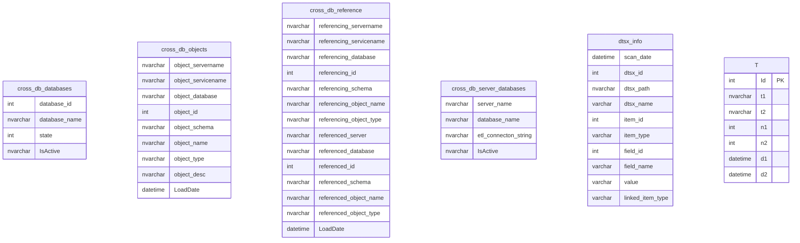
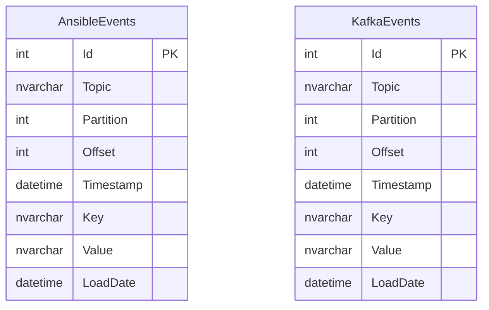
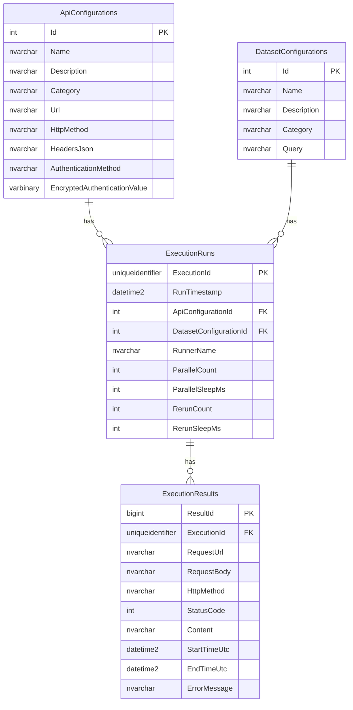
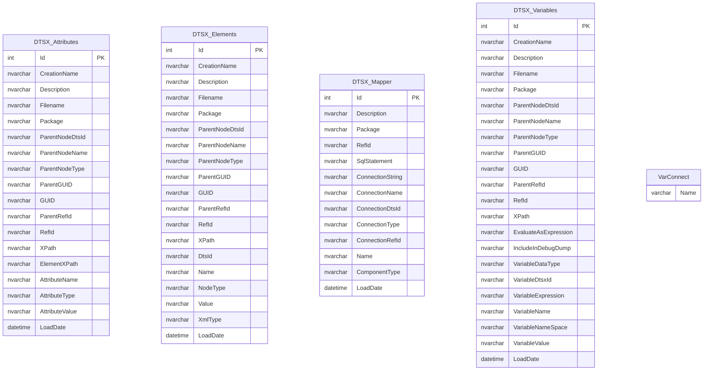
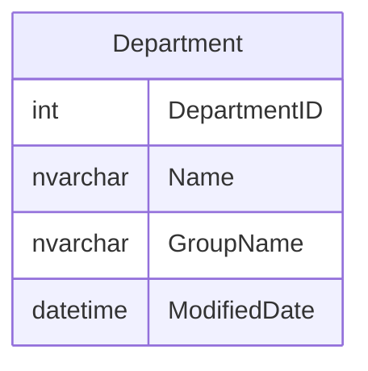
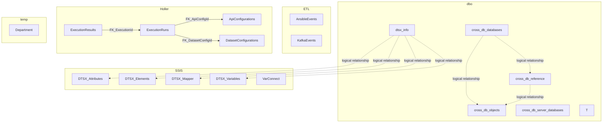
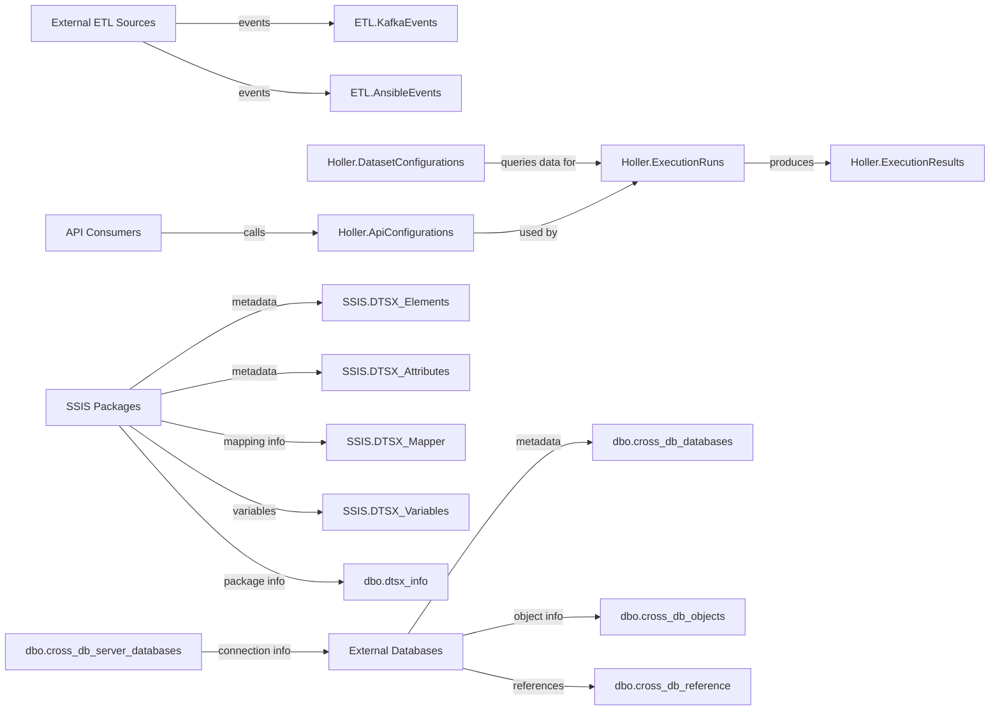

# SQL Database Schema Analysis and Visualization

Based on the database schema retrieved from `#GetTableMetadata connectionName=PROTO`, I'll provide a comprehensive analysis and visualization of the database structure.

## Copilot Prompt used to create this
Recommend making sure you have something like `Markdown Preview Mermaid Support` installed, so you can view the graphs.
```
summarize data from #GetTableMetadata connectionName=PROTO and create mermaid graphs for all sql objects discovered

```

## Database Overview

The PROTO database contains 18 tables distributed across 5 schemas:

- **dbo** (6 tables): Cross-database tracking and SSIS package information
- **ETL** (2 tables): Event tracking for Ansible and Kafka
- **Holler** (4 tables): API configuration and execution monitoring
- **SSIS** (5 tables): SQL Server Integration Services metadata
- **temp** (1 table): Test/temporary tables

## Schema Diagrams

### dbo Schema



### ETL Schema



### Holler Schema (with Relationships)



### SSIS Schema



### temp Schema



## Cross-Schema Relationships Diagram



## Data Flow Diagram



## Key Insights

1. **Holler Schema**: Implements a robust API orchestration system with proper foreign key relationships between tables.

2. **ETL System**: Tracks events from both Kafka and Ansible with identical table structures, suggesting a unified event processing approach.

3. **Cross-Database Tracking**: The dbo schema contains tables for tracking database objects across multiple databases, indicating a centralized metadata repository.

4. **SSIS Metadata**: Extensive tracking of SSIS package components across multiple tables, likely for auditing or documentation purposes.

5. **Testing Area**: The temp schema with a single Department table suggests an area for testing or development.

6. **Sample Table**: The table T in dbo schema contains various data types and is the only table in dbo with a primary key, suggesting it may be used for testing or as a template.

The database appears to implement a comprehensive system for tracking cross-database dependencies, monitoring API executions, and documenting ETL processes with SSIS, with proper separation of concerns across different schemas.
